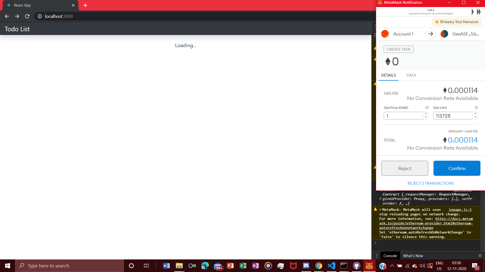
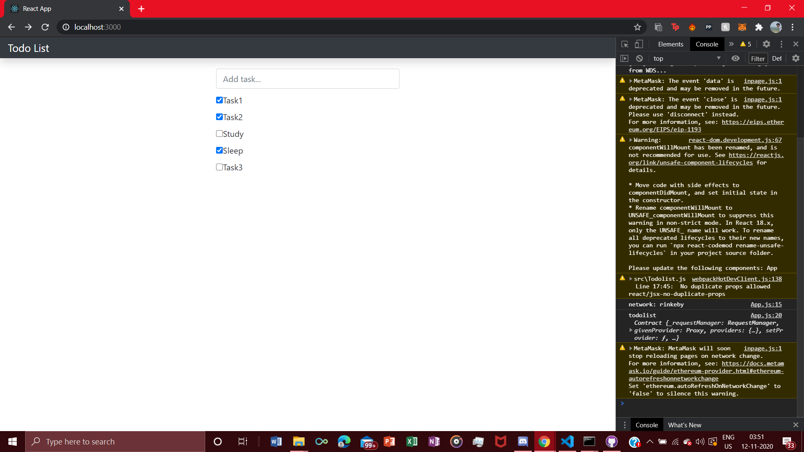
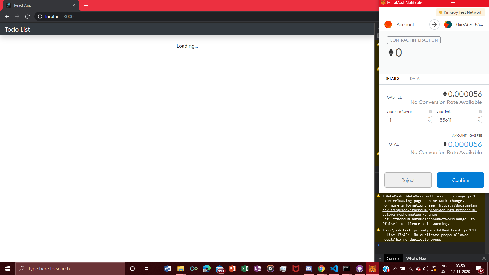

# TodoList-Blockchain

It is a ethereum blockchain based TO DO list. It can set up tasks in the blockchain network and once you complete the task you can toggle it done. Both setting up a task and toggling it after completion requires some gas. The whole network is running on the Rinkeby Test Network of Ethereum.

Versions used :-

 1) solidity - 0.7.4 (latest ver.)
 
 2) truffle/hdwallet-provider - 1.1.1
 
 3) ganache cli - 6.12.1
 
 4) web3 - 1.0.0-beta.26
 
 5) mocha - 8.2.0
 
 6) React - v17.0

 Pictures of the application :- 
 
  
  
  
  
  
  
  
  
  
